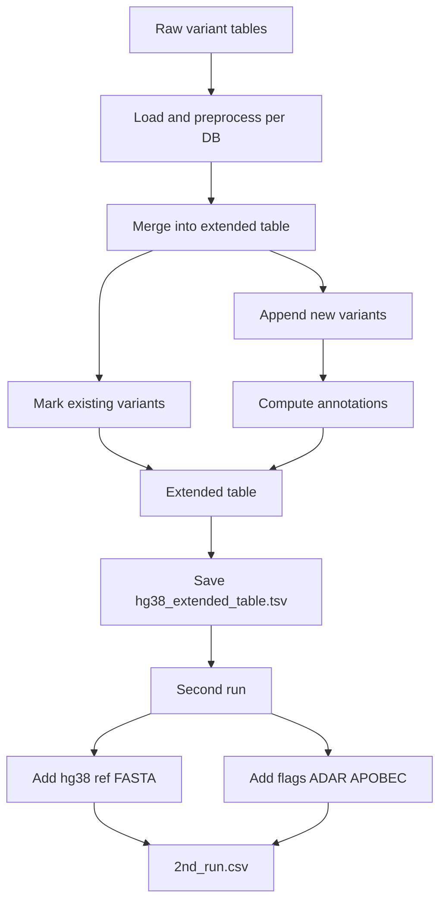

# 🧬 In Silico Analysis for ADAR1-Mediated Correction of Autism Variants

This repository contains a computational pipeline for identifying **autism-associated genetic variants** that could be **therapeutically corrected via ADAR1-mediated RNA editing**.  
It integrates genomic data analysis with RNA editing knowledge to pinpoint candidate variants that Adenosine Deaminase Acting on RNA (ADAR1) might target and “fix” at the RNA level.

---

## 📖 Background and Biological Context

### ADAR1 and A-to-I RNA Editing
- **ADAR1** catalyzes the conversion of **adenosine (A) → inosine (I)** in double-stranded RNA.  
- Inosine is interpreted as **guanosine (G)**, effectively causing **A-to-G changes in RNA**.  
- This process prevents self-RNA from being mistaken as viral, regulating **innate immune activation** and maintaining **cellular balance**.  

### Therapeutic RNA Editing
- By pairing with a **guide RNA**, ADAR1 can be directed to a transcript to correct pathogenic variants **without altering DNA**.  
- This approach is **reversible, tissue-specific, and safer** than permanent genome editing.  
- Thousands of pathogenic **G→A mutations** (introducing an “A” in RNA) could theoretically be corrected by ADAR-driven editing.

### Relevance to Autism (ASD)
- Autism Spectrum Disorder (ASD) is a **neurodevelopmental condition** with strong genetic components.  
- Recent genomic studies identified **134 ASD-associated genes** with many rare pathogenic variants.  
- If these variants are **G→A substitutions**, ADAR1 could potentially **restore normal protein function** at the RNA level.  

---

## 📂 Repository Structure

```
ASD_ADAR_Correction/
├── extended_variants_table
│   ├── 2nd_run.py                  # Append hg38 ref sequence + ADAR/APOBEC flags + DB support count
│   ├── db.py                       # Base classes for variant/validation DB wrappers
│   ├── extended_table.py           # Core logic to merge DBs into an extended variant table
│   ├── hg38_main.py                # CLI entry-point to build hg38_extended_table.tsv
│   ├── hg38.sh                     # (helper; optional)
│   ├── instructions_provider.py    # Loads per-DB instructions and annotation functions
│   ├── table_analysis/
│   │   └── varicarta_analysis_copy.ipynb
│   └── vep_results/                # (optional) VEP outputs if generated
├── resources
│   └── DBs
│       ├── hg37
│       │   ├── validation
│       │   │   └── default
│       │   │       ├── instructions.py
│       │   │       └── pre_process.py
│       │   └── variants
│       │       └── default
│       │           ├── annotations_func.py
│       │           ├── instructions.py
│       │           └── pre_process.py
│       └── hg38
│           ├── validation
│           │   └── default
│           │       ├── instructions.py
│           │       └── pre_process.py
│           └── variants
│               ├── default
│               │   ├── annotations_func.py
│               │   ├── instructions.py
│               │   ├── pre_process.py
│               │   ├── vep_ann.sh            # helper to run VEP (optional)
│               │   └── vep_results/          # where VEP results should be stored
│               └── liftOverToHg38.sh         # liftOver helper (optional)
├── LICENSE
├── README.md
```

---

## ⚙️ Installation and Setup

### Requirements
- Python 3.10+
- Recommended: Conda or venv
- For optional annotations:
  - Ensembl VEP and cache (if using `vep_ann.sh`)
  - UCSC liftOver (if using `liftOverToHg38.sh`)

### Python dependencies
Create a virtual environment and install dependencies:

```bash
# conda (example)
conda create -n ASD_ADAR_env python=3.10 -y
conda activate ASD_ADAR_env
pip install -r requirements.txt

# or virtualenv
python3 -m venv .venv
source .venv/bin/activate
pip install -r requirements.txt
```

If you plan to run `extended_variants_table/2nd_run.py`, ensure the FASTA indexer is available:

```bash
pip install pyfaidx pandas
```

---

## 🧩 Concepts: How the Pipeline Works

The pipeline builds an “extended” variant table by merging multiple ASD variant sources, standardizing key columns, and adding computed annotations.

- **Instructions-driven design**: Each database (variant source or validation source) has an `instructions.py` that defines:
  - `name`, `description`, `key_cols` (e.g., `chr`, `pos`, `ref`, `alt`)
  - `upload_function` and `pre_processor` to load and normalize columns
  - `annotations` mapping with compute functions (e.g., ADAR/APOBEC fixability, VEP)
- **Merging logic** (`extended_table.py`):
  - Creates a wide table with keys leading, then one indicator column per source DB
  - For each DB: existing variants get the indicator set to 1; new variants are appended, with annotations computed
  - Optional validation DBs can check consistency
- **Second pass** (`2nd_run.py`): Adds convenience columns to a saved table:
  - `hg38`: reference base sequence pulled from a FASTA
  - `is_ADAR_fixable` and `is_APOBEC_fixable`: strand-aware base-change flags
  - `dbs_count`: number of sources supporting the variant

---

## ▶️ How to Run

Below are the minimal steps to reproduce the full table on hg38.

### 0) Prepare database instructions and inputs
- Put your database instruction trees under a single directory, e.g. `resources/DBs/hg38/` containing:
  - `variants/default/` and optionally additional variant DB folders
  - `validation/default/` (optional) and additional validation DB folders, e.g. `validation/ClinVar/`
- Ensure each DB folder includes an `instructions.py` (and `pre_process.py`, `annotations_func.py` as needed).
- Place input tables named `variants_table.tsv` inside each DB folder.

### 1) Build the extended table (hg38)
Run the interactive entry-point and provide the DBs directory path when prompted:

```bash
python extended_variants_table/hg38_main.py
# Example prompt input:
# /Users/znave/Documents/GitHub/ASD_ADAR_Correction/resources/DBs/hg38
```

This will:
- Discover available variant and validation DBs under the path
- Load `key_cols` and annotation functions from `variants/default/instructions.py`
- Merge all variant sources into an extended table
- Optionally save it as `hg38_extended_table.tsv` in `extended_variants_table/`

Non-interactive tip (Mac/Linux): you can export the path so it’s easy to paste:

```bash
echo "/Users/znave/Documents/GitHub/ASD_ADAR_Correction/resources/DBs/hg38"
```

### 2) Second run: add FASTA and flags
After saving `hg38_extended_table.tsv`, run:

```bash
python extended_variants_table/2nd_run.py
```

What it does:
- Reads `extended_variants_table/hg38_extended_table.tsv`
- Adds columns: `hg38`, `is_ADAR_fixable`, `is_APOBEC_fixable`, `dbs_count`
- Writes `extended_variants_table/2nd_run.csv`

Notes:
- The script expects a FASTA at `extended_variants_table/../resources/hg38.fa` by default. Adjust the path in `2nd_run.py` if needed.
- Required columns in the TSV: `chr`, `pos`, `ref`, `alt`, `STRAND`.

---

## 📊 Outputs

- `extended_variants_table/hg38_extended_table.tsv`: merged table across variant sources with annotations
- `extended_variants_table/2nd_run.csv`: augmented table with reference sequence and fixability flags

Key columns you may see:
- `chr`, `pos`, `ref`, `alt`: genomic keys
- One indicator column per source DB (e.g., `Varicarta`)
- Annotation columns from `annotations_func.py` (e.g., VEP-derived fields)
- `is_ADAR_fixable`, `is_APOBEC_fixable`, `dbs_count`, `hg38`

---

## 🔧 Extending the pipeline

- Add a new variant DB: create `resources/DBs/hg38/variants/<your_db>/` with:
  - `instructions.py` (defines loader, keys, annotations)
  - your `variants_table.tsv` input
- Add/modify annotations: implement compute functions in `annotations_func.py`, reference them in `instructions.py` under `annotations`
- Add a validation DB: create `resources/DBs/hg38/validation/<your_db>/` with `instructions.py` and a `validator` function

---

## 👥 Contact & Citation

- **Nave Zehoray** – [GitHub: znavezz](https://github.com/znavezz)
- **Oded Wertenschlag** – Contributor

📧 For questions, open an issue in this repository.

---

✨ This project brings together **genomics, RNA biology, and bioinformatics** to explore RNA editing as a therapeutic avenue for autism.

## 🗺️ Pipeline Flow




